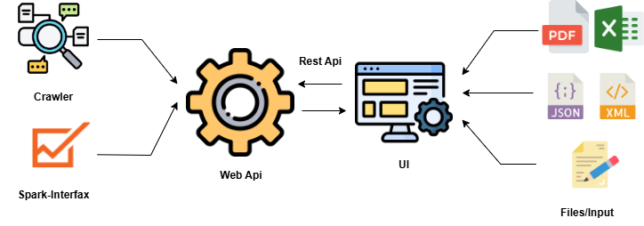

# Система анализа данных

## Обзор
Веб-приложение для сбора, обработки и анализа данных с возможностями машинного обучения.

## Архитектура
Система построена по трехзвенной REST-архитектуре:

### Компоненты системы

- **Frontend** - Пользовательский интерфейс
  - Формы ввода данных с валидацией
  - Загрузка файлов различных форматов
  - Интерактивная визуализация данных и графики
  - Адаптивный веб-дизайн

- **Backend** - Бизнес-логика
  - Обработка и преобразование данных
  - Интеграция и выполнение ML-моделей
  - Управление API-ендпоинтами
  - Координация работы с хранилищем данных

- **Database** - Хранилище данных
  - Реляционная база данных
  - Структурированное хранение информации
  - Управление транзакциями

## Функциональность

### Сбор данных
- **Ручной ввод**: формы и загрузка файлов
- **Поддерживаемые форматы**:
  - PDF, Excel, XAML
  - JSON через API
- **Автоматизированный сбор**:
  - WebHook для автоматической загрузки
  - Встроенный парсер (Crawler)
  - REST API интеграции

### Анализ данных
- **ML Audit**:
  - Экспресс-аналитика компаний
  - Обнаружение аномалий
  - Валидация данных
  - Статистический анализ
- **Визуализация**:
  - Интерактивные графики
  - Панели мониторинга
  - Отчеты в реальном времени

## Технологии

- **Frontend**: React (TypeScript)
- **Backend**: ASP (C#), FastApi (Python)
- **Database**: Postgres
- **ML**: Интеграция с ML-библиотеками

## Установка и запуск

[Здесь будет инструкция по установке и настройке системы]
